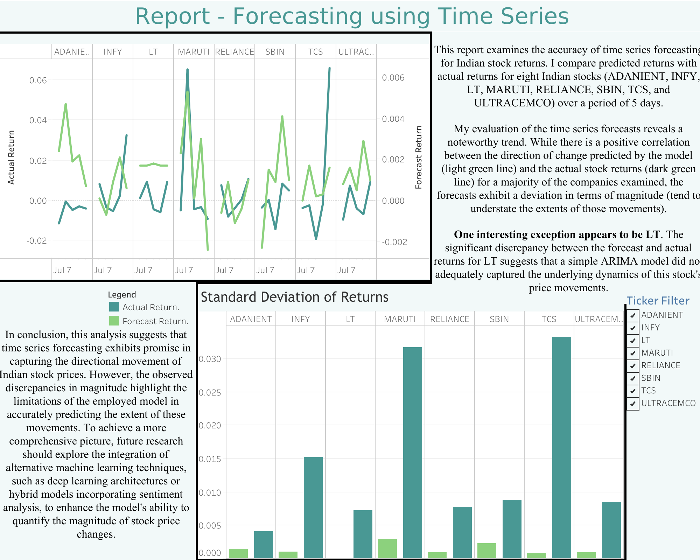

# Stock Price Forecasting Project

## Overview

This project aims to forecast stock prices using ARIMA models and analyze their accuracy.

## Contents
1. **Data Preprocessing**: Cleansing and preparing historical stock price data.
2. **Modeling**: Implementing ARIMA models to forecast future stock prices.
3. **Visualization**: Plotting historical prices, forecasted prices, and evaluation metrics.
4. **Stored Models**: Maintaining a record of optimal model parameters.
5. **Accuracy Assessment**: Comparing predicted values with actual data for validation.
6. **Reports**: Detailed visual reports generated using Tableau.

## Files

- `stock.ipynb`: Jupyter Notebook containing the main code for the project.
- `stored_models.csv`: CSV file storing the best model parameters for each stock ticker.
- `prediction_accuracy.xlsx`: Excel file for comparing predicted and actual stock prices to assess model accuracy.
- `tableau_dash.png`: Image file of the Tableau dashboard visual report.
- `tableau_wb.twbx`: Tableau workbook containing the visual report.

## Usage

- Clone the repository.
- Open `stock.ipynb` to explore the code and run the project interactively using Jupyter Notebook.

## Requirements

- Python 3
- Required Python packages (NumPy, Pandas, Matplotlib, Statsmodels, nselib)

## Reports

1. Time Series Prediction Accuracy Report

## Author

Aarav Gosalia
 
